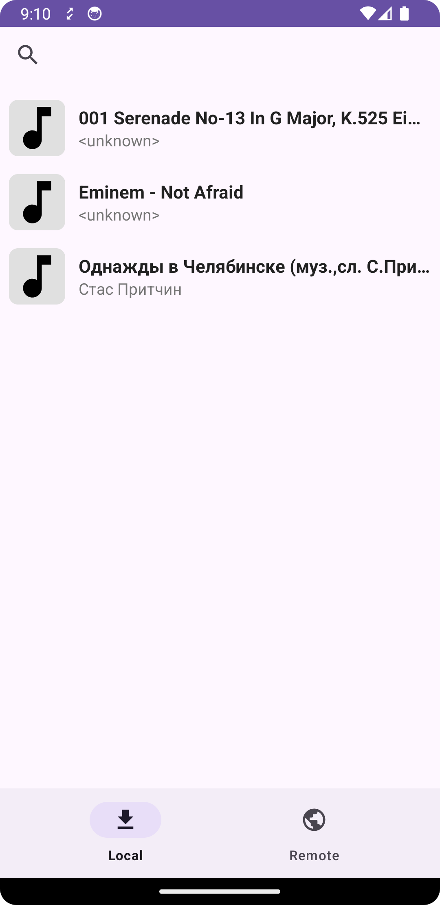

# Music Player

## Описание
это Android-медиаплеер, предназначенный для воспроизведения аудио. Приложение использует Jetpack Media3 для работы с мультимедийными файлами и поддерживает современные технологии Android.

## Ключевые функции:
- Воспроизведение аудио
- Поддержка популярных форматов
- Интуитивно понятный интерфейс
- Интеграция с сетью через Retrofit и OkHttp
- Управление воспроизведением через Media3
- Dependency Injection через Dagger2
- Обработка изображений с помощью Coil
- Логирование сетевых запросов с Chucker

## Установка
1. Клонируйте репозиторий:
   ```sh
   git clone https://github.com/nbespalovv/MusicPlayer.git
   cd MusicPlayer
   ```
2. Откройте проект в **Android Studio**.

## Запуск в Android Studio
1. Откройте Android Studio и выберите `File > Open`, затем укажите папку с проектом.
2. Дождитесь завершения загрузки зависимостей Gradle.
3. Подключите физическое устройство или запустите эмулятор.
4. Нажмите **Run** (`Shift + F10` или ▶️ в панели инструментов).

## Запуск через терминал
1. Запустите сборку приложения:
   ```sh
   ./gradlew assembleDebug
   ```
2. Установите APK на подключённое устройство:
   ```sh
   adb install app/build/outputs/apk/debug/app-debug.apk
   ```
## Выдача разрешений вручную
После установки APK необходимо вручную выдать разрешения в настройках устройства:
1. Откройте Настройки → Приложения → PlayerAvito → Разрешения
2. Разрешите доступ к медиафайлам, уведомлениям и хранилищу
3. Если приложение не видит файлы, перезапустите его

<p float="left">
   
   
   
   
   
</p>